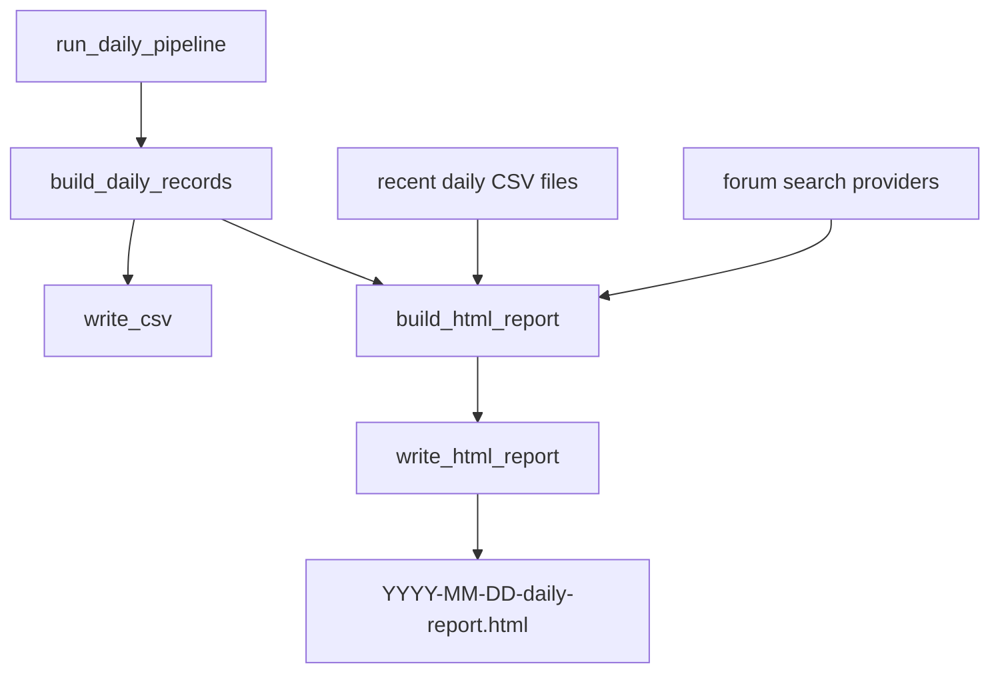

# Daily HTML Report Design

## Goal

生成每日复盘 CSV 的同时，同步生成一份 HTML 解读报告，用来总结当日涨停板块结构、连板梯队、成交额核心、近期板块趋势，并汇总雪球及类似论坛中的市场讨论线索。

## Approved Approach

采用方案 A：HTML 报告作为日报 CSV 的同步产物。

默认输出：

```text
outputs/daily/YYYY-MM-DD-daily-review.csv
outputs/daily/YYYY-MM-DD-daily-report.html
```

如果论坛检索失败、网络不可用、目标站点反爬或返回空结果，日报 CSV 仍正常生成；HTML 报告保留本地复盘分析，并在“市场讨论摘要”处显示论坛线索未获取。

## Scope

本功能包含：

- 从当日 `DailyRecord` 列表生成 HTML 报告。
- 读取最近 3-5 份历史日报 CSV，分析近期板块变化趋势。
- 基于当日复盘记录汇总涨停板块结构、连板梯队、成交额核心、主线/支线/轮动分布。
- 检索雪球及类似论坛，按核心题材和重点个股归纳市场讨论中的可能原因。
- 在 CLI 和 GUI 的日报生成流程中同步产出 HTML 报告。

本功能不包含：

- 自动下交易结论或买卖建议。
- 把论坛讨论当作已证实事实。
- 对需要登录或强隐私授权的站点进行绕过式抓取。
- 建立长期论坛内容数据库。

## Output Report Structure

HTML 报告包含以下章节：

1. **当日总览**
   - 交易日期。
   - 涨停记录数量。
   - 最高连板高度。
   - 市场阶段。
   - 市场情绪摘要。
   - 成交额最高的 3-5 只重点股。

2. **板块结构**
   - 按 `核心题材` 汇总。
   - 每个题材展示涨停数量、总成交额、最高连板、代表个股、题材层级。
   - 优先使用 refined daily output 中的 `所属行业` 细分标签辅助解释板块结构，例如 `半导体-存储器/MCU芯片`。

3. **连板梯队**
   - 按 `涨停板数` 分组展示：首板、2板、3板及以上。
   - 如果 `涨停板数` 缺失，使用 `阶段` 和 `角色依据` 中的连板信息兜底。
   - 突出最高板、断层、容量核心。

4. **近期变化趋势**
   - 默认比较最近 5 份 `*-daily-review.csv`。
   - 汇总涨停数量变化、最高连板高度变化、核心题材升降温。
   - 输出自然语言结论，例如“半导体连续 3 日位居前二，存储器分支扩散，TMT 内部分歧加大”。

5. **市场讨论摘要**
   - 检索雪球及类似论坛。
   - 查询词优先使用核心题材和重点股名称，例如 `{核心题材} 涨停 原因`、`{股票名称} 涨停`。
   - 每条摘要必须标注来源名称、标题或短摘、链接、发布时间或抓取时间。
   - 明确标注“市场讨论，未经证实”，并与公告、新闻、龙虎榜等证据来源区分。

6. **风险提示**
   - 区分规则推断、论坛讨论、新闻公告、龙虎榜资金。
   - 提醒论坛观点可能存在情绪化、滞后、误传或幸存者偏差。

## Data Flow



`build_html_report` 只依赖结构化 `DailyRecord`、最近历史 CSV 解析结果和论坛检索结果。论坛检索模块返回空数据时，报告生成仍必须成功。

## Components

### `src/ghzw/reporting.py`

新增报告模块，负责纯本地汇总和 HTML 渲染。

核心接口：

```python
def build_report_context(trade_date, records, recent_records_by_date, forum_discussions):
    ...

def render_html_report(context):
    ...

def write_html_report(html, output_path):
    ...
```

职责：

- 统计板块结构。
- 统计连板梯队。
- 统计近期趋势。
- 渲染安全的静态 HTML。
- 不直接访问网络。

### `src/ghzw/forum_sources.py`

新增论坛检索模块，负责把外部讨论统一成结构化数据。

核心接口：

```python
class ForumDiscussion:
    source: str
    title: str
    summary: str
    url: str
    published_at: str
    query: str


def collect_forum_discussions(trade_date, records, enabled=True):
    ...
```

第一版来源：

- 雪球。
- 东方财富股吧或其他公开可访问财经讨论页面。

实现原则：

- 首选公开网页或搜索结果。
- 不绕过登录、验证码或反爬限制。
- 每个查询限制结果数量，避免生成过慢。
- 网络失败返回空列表和 warning，不抛出阻断日报的异常。

### `src/ghzw/pipeline.py`

扩展 `DailyPipelineResult`：

```python
report_path: Optional[Path] = None
report_warning: str = ""
```

扩展 `run_daily_pipeline`：

- 写 CSV 后生成 HTML 报告。
- 默认开启 HTML 报告。
- 论坛检索可通过参数控制。
- 论坛失败只设置 `report_warning`。

### CLI

`src/ghzw/cli.py` 增加参数：

```text
--no-html-report
--no-forum-search
```

默认行为：

- 生成 CSV。
- 生成 HTML 报告。
- 尝试论坛检索。

如果用户关闭论坛检索，报告仍生成，但“市场讨论摘要”显示“未启用论坛检索”。

### GUI

`src/ghzw/gui.py` 在 `/api/run-daily` 返回值中增加：

```json
{
  "report_html_path": "2026-06-17-daily-report.html",
  "report_warning": ""
}
```

GUI 初版只需要在生成成功消息里提示 HTML 报告文件名，并在历史报表列表中识别 HTML 报告。CSV 表格预览仍按原逻辑处理。

## Error Handling

- CSV 生成失败：整个日报生成失败，按现有逻辑返回错误。
- HTML 本地汇总失败：日报接口返回错误，因为这是同步产物且依赖本地数据，应通过测试保证稳定。
- 近期历史 CSV 读取失败：跳过该历史文件，并在报告中说明跳过数量。
- 论坛检索失败：不影响 CSV 和 HTML 主体；报告中显示“论坛线索未获取”，GUI/CLI 显示 warning。
- 单条论坛结果字段缺失：保留来源和链接，缺失字段显示为空字符串。

## Testing

新增测试覆盖：

- `reporting.py` 对板块结构、连板梯队、近期趋势的统计。
- HTML 输出包含关键章节、股票名称、核心题材、趋势结论和论坛来源链接。
- `forum_sources.py` 在模拟返回、空返回、异常返回时都能输出稳定结构。
- `pipeline.py` 能在写 CSV 后同步写 HTML。
- CLI 参数 `--no-html-report` 和 `--no-forum-search` 正确传递。
- GUI API 返回 HTML 报告路径。

## Relationship To Refined Daily Output

HTML 报告依赖 refined daily output 的字段口径：

- `所属行业` 使用更细分板块标签。
- `涨停板数` 用于连板梯队。
- `成交额(亿元)` 用于展示；内部计算仍使用 `DailyRecord.turnover` 的元单位。

因此实现顺序应为：

1. 先执行 refined daily output 方案 1。
2. 再实现 HTML 报告。

## Open Assumptions

- 用户确认“学球”指“雪球”。
- HTML 报告使用静态文件，不需要新增前端框架。
- 论坛检索需要联网；在无法联网或站点限制访问时，以本地复盘分析为主。
- 当前项目目录不是 Git 仓库，因此实施计划中的提交步骤应在执行时跳过或改为手动版本管理。
