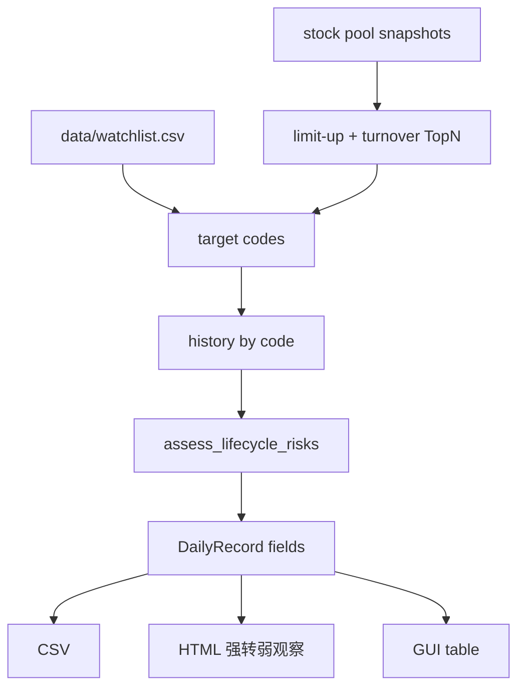

# Position Lifecycle Risk Design

## Goal

把分享对话里的“高位强势股强转弱观察框架”固化进股海贼王系统：日报自动识别强转弱风险，同时维护一张可手工增补的自选观察名单，用于连续跟踪重点持仓或高位趋势股。

## Approved Approach

采用“日报自动评分 + 自选观察名单”的组合。

日报侧负责从当日涨停和成交额核心里自动筛出高位风险候选，并输出强转弱阶段、风险分、触发信号和观察纪律。观察名单侧读取 `data/watchlist.csv`，把用户关心的股票纳入同一套分析，即使它们当天不在涨停或成交额 TopN 中，也能在报告里长期跟踪。

## Scope

本功能包含：

- 新增资金生命周期/强转弱风险评估模型。
- 在 `DailyRecord` 中增加强转弱相关字段。
- 读取可选 `data/watchlist.csv`，字段为 `代码,名称,核心题材,备注`。
- 日报目标池包含涨停、成交额 TopN 和观察名单股票。
- HTML 报告新增“强转弱观察”章节。
- GUI 表格优先展示强转弱字段，并支持按强转弱阶段筛选。

本功能不包含：

- 自动交易、下单或仓位执行。
- 精确实时 L2 DDX 计算。
- 对未纳入历史 K 线和快照范围的外部股票做单独联网补数。
- 以“风险分”替代人工判断。

## Risk Model

评估目标是判断一只高位强势股处于哪种资金状态：

1. **一致加速**：趋势完整、仍创新高、未明显放量滞涨。
2. **高位换手**：高位分歧增加，但趋势未破坏。
3. **强转弱验证**：修复失败、无法创新高、相对板块或自身趋势开始落后。
4. **趋势破坏**：跌破关键趋势、放量下跌、资金或价格结构持续转弱。

第一版用系统现有数据近似：

- 趋势完整度：MA5、MA10、MA20 与收盘价关系。
- 修复能力：最近 3-5 日是否重新接近或突破前高。
- 放量滞涨：成交额显著放大但价格未创新高或涨幅不足。
- 放量下跌：当日下跌且成交额高于近 5 日均值。
- 高位位置：收盘价相对近 60 日区间的位置。
- 相对强弱：当日涨幅与同核心题材样本平均涨幅的差值。
- 连续观察：若历史日报中已有该字段，后续可叠加连续弱势天数。

风险分越高表示越需要收紧纪律，不等同于卖出指令。

## Data Flow

## Components

### `src/ghzw/lifecycle.py`

新增纯分析模块，不访问网络。

核心数据结构：

- `WatchlistEntry`
- `LifecycleRisk`

核心函数：

- `load_watchlist(path)`
- `assess_lifecycle_risks(snapshots, history_by_code, core_theme_by_code)`

### `src/ghzw/models.py`

`DailyRecord` 新增：

- `watchlist_note`
- `lifecycle_stage`
- `lifecycle_score`
- `lifecycle_signals`
- `lifecycle_discipline`

CSV 输出新增：

- `观察备注`
- `强转弱阶段`
- `强转弱风险分`
- `强转弱信号`
- `观察纪律`

### `src/ghzw/pipeline.py`

`build_daily_records` 增加 `watchlist_entries` 参数，把观察名单代码并入目标池；如观察名单股票不在快照中，则跳过并不中断。

`run_daily_pipeline` 读取默认 `data/watchlist.csv`，无文件时返回空名单。

### `src/ghzw/reporting.py`

新增“强转弱观察”章节，按风险分排序展示前 10 个重点项，并突出观察名单股票。

### GUI

`src/ghzw/gui_assets/app.js` 把强转弱字段加入优先列和筛选字段。

## Error Handling

- `data/watchlist.csv` 不存在：视为空名单。
- 观察名单字段缺失：能读取代码即可，其余字段为空。
- 观察名单股票不在股票池或无快照：跳过，不影响日报。
- 历史 K 线不足：输出“观察”，风险分只使用当日和可用历史。

## Testing

新增或扩展测试：

- 观察名单读取空文件、缺失文件和正常 CSV。
- 高位放量滞涨、跌破 10 日线、相对弱于题材时风险分和信号正确。
- `build_daily_records` 会包含观察名单股票。
- CSV 字段包含强转弱相关输出。
- HTML 报告包含“强转弱观察”章节。
- GUI 优先字段和筛选字段包含强转弱阶段。

## Open Assumptions

- `data/watchlist.csv` 使用 UTF-8 或 UTF-8-SIG。
- 股票代码沿用系统内部格式，例如 `SH.600001`、`SZ.300001`。
- 第一版相对强弱以日报目标池中的同核心题材样本计算；后续可升级为全板块成分或指数比较。
